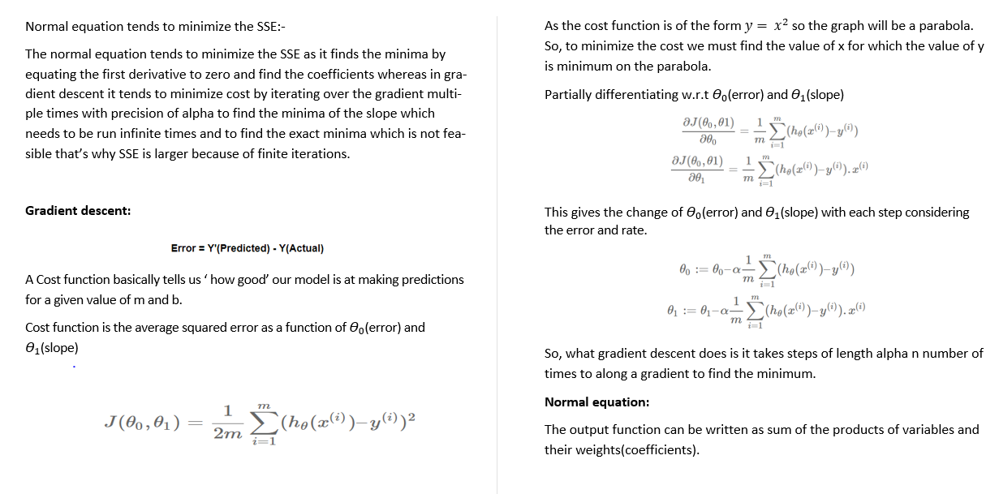
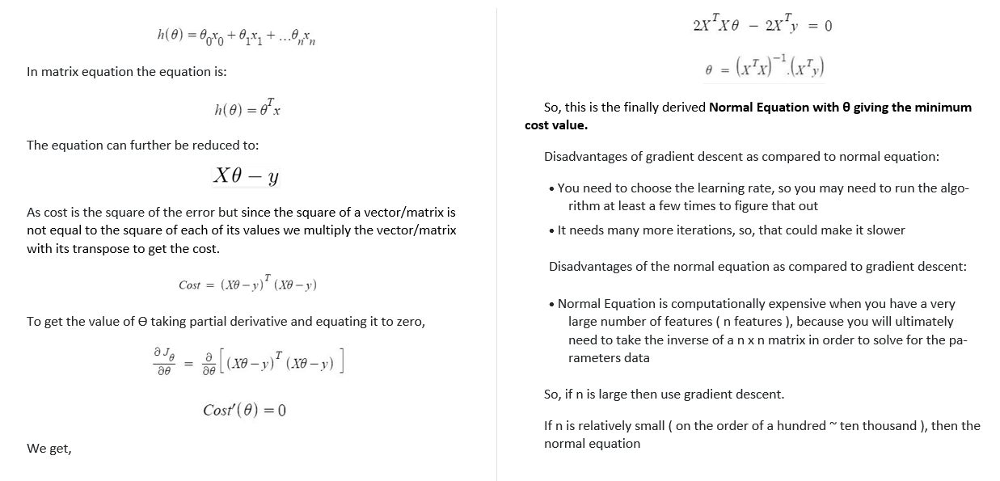

# Python-OLS-gradient-descent-and-normal-equation-linear-regresion-from-scratch
The repository contains code to implement the gradient descent method of linear regression and normal equation method of linear regression. The code is in the form of a well commented jupyter notebook to help the audience understand the code and concept better.

The code is implemented without use of any preexisting library and only using the core concept behind the two algorithms.

The two algorithms are implemented using Ordinary Least Squares approach and compared on the basis of RMSE and R2.

